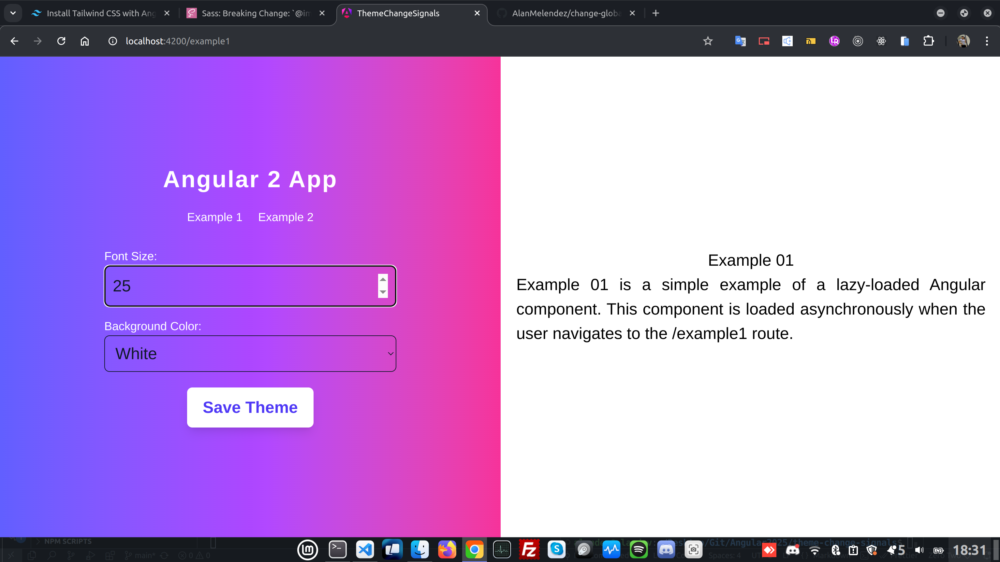
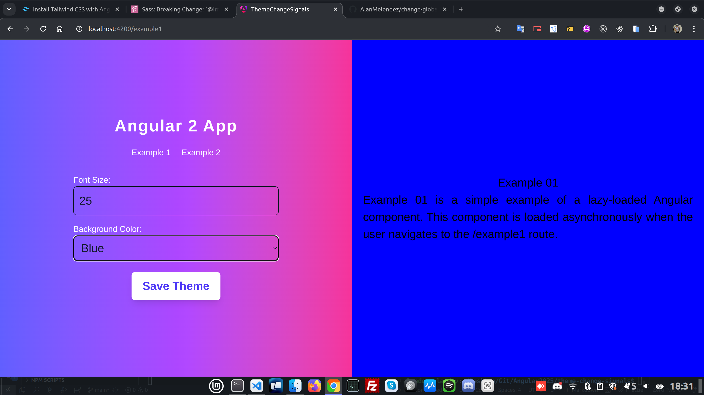
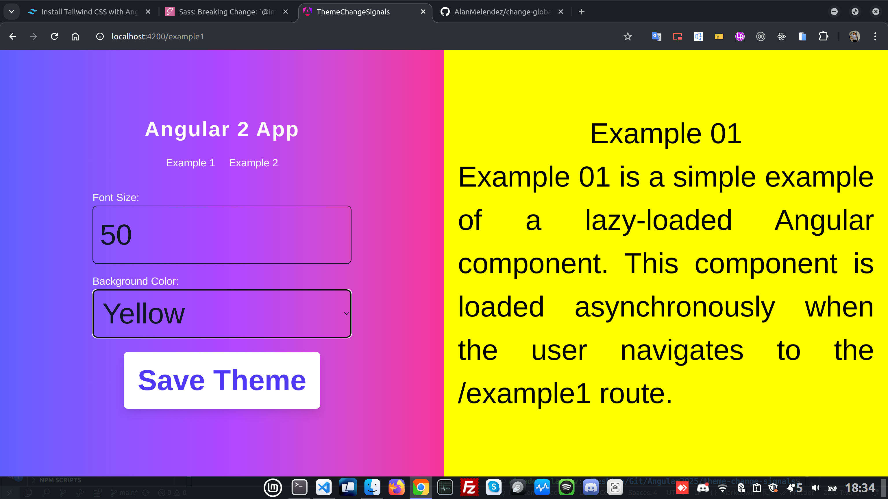

# Theme Change Signals

Welcome to the **Theme Change Signals** project! This project demonstrates how to implement theme change signals in an Angular application.

## Table of Contents

- [Introduction](#introduction)
- [Features](#features)
- [Installation](#installation)
- [Usage](#usage)
- [Screenshots](#screenshots)
- [Contributing](#contributing)
- [License](#license)

## Introduction

The **Theme Change Signals** project is designed to help developers easily switch between different themes in an Angular application. This can enhance the user experience by allowing users to choose their preferred theme.

## Features

- Easy theme switching
- Responsive design
- Customizable themes
- Lightweight and fast

## Installation

To get started with the project, follow these steps:

1. Clone the repository:
    ```bash
    git clone https://github.com/AlanMelendez/change-global-theme-Angular19
    ```
2. Navigate to the project directory:
    ```bash
    cd theme-change-signals
    ```
3. Install the dependencies:
    ```bash
    npm install
    ```

## Usage

To run the application, use the following command:
```bash
ng serve
```
Open your browser and navigate to `http://localhost:4200` to see the application in action.

## Screenshots

Here are some screenshots of the application:





## Contributing

We welcome contributions! Please read our [contributing guidelines](CONTRIBUTING.md) to get started.

## License

This project is licensed under the MIT License. See the [LICENSE](LICENSE) file for more details.
